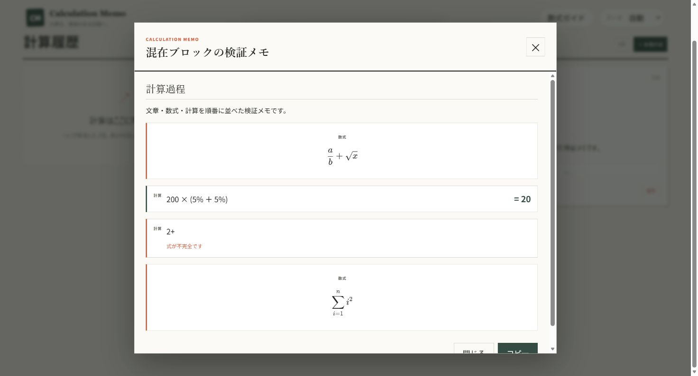
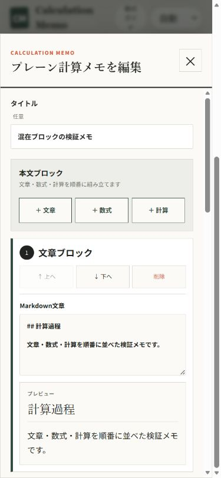
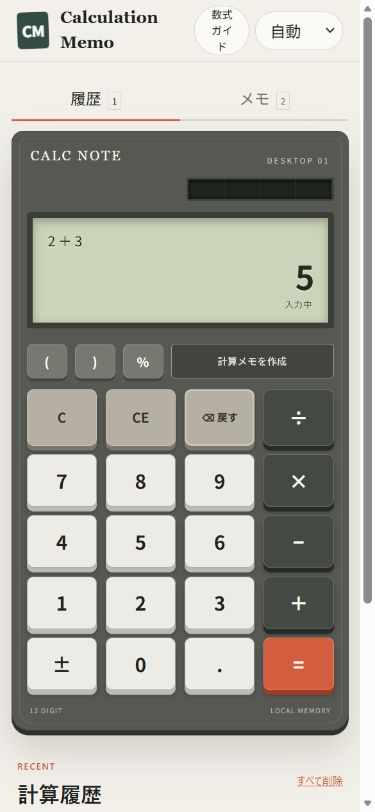

# Calculation Memo

卓上電卓のような操作感で計算し、式と結果を履歴や「計算メモ」として残せるWebアプリです。データは現在、利用しているブラウザ内だけに保存されます。

## 主な機能

- 四則演算、小数、負数、括弧、符号反転、パーセントに対応した通常電卓
- 計算式と結果を同時に確認できる2段の液晶表示
- 正常に完了した計算の履歴保存、復元、コピー、削除
- 文章、数式、複数の計算式を組み合わせられる計算メモ
- 電卓の1つの式と結果を保存する単独計算メモ
- 単独計算メモの計算式・タイトル・メモを後から編集でき、式の変更時は保存時に結果を自動再計算
- 証明、計算過程、解説、和算、複数式をMarkdownで自由に記録
- 文章、表示専用のKaTeX数式、評価可能な計算式を混在できる本文ブロック
- 各ブロックの追加、編集、削除、上下移動と、複数ブロックの保存・復元
- Markdown本文内のインライン数式（`$...$`）と独立した数式（`$$...$$`）をKaTeXで表示
- 検索、コピー、編集中の入力欄への挿入ができる数式ガイド
- ライト／ダークテーマ、キーボード操作、レスポンシブ表示

## 2種類の計算メモ

「計算メモ」は、文章ブロック、数式ブロック、計算ブロックを自由な順序で組み立てる正式なメモ種別です。文章ブロックはMarkdown、数式ブロックは表示専用のKaTeX、計算ブロックは通常電卓と同じ計算エンジンによる式と結果を保持します。ブロックごとに追加、編集、削除、上下移動ができ、不正な計算式はそのブロック内だけにエラー表示されます。

「単独計算メモ」は、電卓で確定した1つの計算式と結果を保存する従来機能です。編集画面では計算式、タイトル、前提・補足を変更できます。計算結果を直接編集する欄はなく、計算式を変更して保存すると同じ電卓ロジックで再計算されます。

本文はブロック構造に加えてMarkdown互換の`content`も保存するため、そのままコピーして別のMarkdown対応ツールへ受け渡せます。従来「プレーン計算メモ」と表示していた既存データも、本文を失わず正式な「計算メモ」として表示・編集できます。

### 画面







## パーセントの仕様

`%`は、直前の数値または括弧式を100で割る単項演算として扱います。一般的な実機電卓にある「基準値に対する相対パーセント加算」ではありません。

```text
200 + 10% = 200.1
200 - 10% = 199.9
200 × 10% = 20
200 ÷ 10% = 2,000
10% = 0.1
```

表示、履歴、コピー結果でも同じ数式として扱われます。

## データ保存

計算履歴、計算メモ、単独計算メモ、テーマ、最後に選択したパネルはブラウザの`localStorage`へ保存されます。アカウント同期やクラウド保存はありません。

保存データのトップレベルバージョンは従来どおり`1`です。表示名だけを整理し、`type: "plain-calculation"`はブロック型の「計算メモ」、`type: "calculation"`は従来の「単独計算メモ」として読み込みます。既存のtype値、単独計算メモ構造、ブロック型メモの`content`は変更していません。

ブラウザのサイトデータや`localStorage`を削除すると、保存した履歴と計算メモは失われる可能性があります。読み込めない保存データを検出した場合は自動保存を停止し、元データのコピーまたは確認付き初期化を選べます。

## 開発環境

Node.js `22.13.0`以上が必要です。

```bash
npm install
npm run dev
```

開発サーバーの表示に従い、通常は `http://localhost:3000` を開きます。

## 検証コマンド

```bash
npm test
npm run lint
npx tsc --noEmit
npm run build
```

## 今後の候補

以下は現時点では未実装です。

- 関数電卓
- 関数電卓追加時の履歴・計算メモ領域のドロワー化
- 保存データの本格的なJSON書き出し・復元
- Memo Nexusとの直接連携
- 複数端末同期
