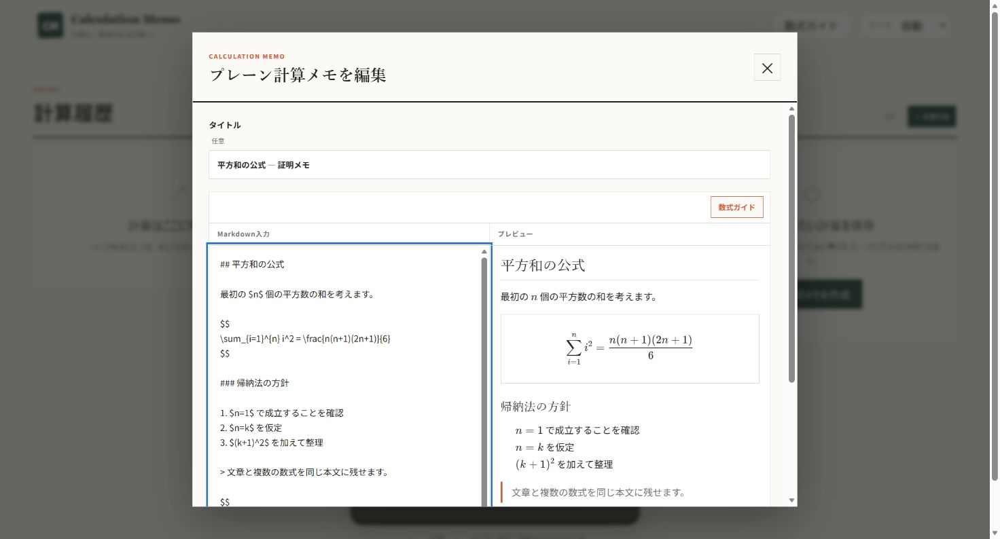

# Calculation Memo

卓上電卓のような操作感で計算し、式と結果を履歴や「計算メモ」として残せるWebアプリです。データは現在、利用しているブラウザ内だけに保存されます。

## 主な機能

- 四則演算、小数、負数、括弧、符号反転、パーセントに対応した通常電卓
- 計算式と結果を同時に確認できる2段の液晶表示
- 正常に完了した計算の履歴保存、復元、コピー、削除
- タイトル、単位、前提、タグ、関連メモ名を付けられる計算メモ
- 計算式・タイトル・メモを後から編集でき、式の変更時は保存時に結果を自動再計算
- 証明、計算過程、解説、和算、複数式をMarkdownで自由に記録できるプレーン計算メモ
- Markdown本文内のインライン数式（`$...$`）と独立した数式（`$$...$$`）をKaTeXで表示
- 検索、コピー、編集中の入力欄への挿入ができる数式ガイド
- ライト／ダークテーマ、キーボード操作、レスポンシブ表示

## 2種類の計算メモ

「計算メモ」は、電卓で確定した計算式と結果を保存します。編集画面では計算式、タイトル、前提・補足を変更できます。計算結果を直接編集する欄はなく、計算式を変更して保存すると同じ電卓ロジックで再計算されます。

「プレーン計算メモ」は、本文をMarkdown文字列のまま保存する自由記述用メモです。編集画面は入力とプレビューを並べて確認でき、モバイルではタブで切り替えられます。数式ガイドから分数、平方根、累乗、添字、ギリシャ文字、総和、積分、行列などのKaTeX記法をコピーまたは本文へ挿入できます。

本文は生成済みHTMLではなくMarkdownとして保存されるため、そのままコピーして別のMarkdown対応ツールへ受け渡せます。現在は見出し、段落、強調、リンク、リスト、引用、コード、区切り線、KaTeX数式の表示に対応しています。

### 画面




## パーセントの仕様

`%`は、直前の数値または括弧式を100で割る単項演算として扱います。一般的な実機電卓にある「基準値に対する相対パーセント加算」ではありません。

```text
200 + 10% = 200.1
200 - 10% = 199.9
200 × 10% = 20
200 ÷ 10% = 2,000
10% = 0.1
```

表示、履歴、コピー結果でも同じ数式として扱われます。

## データ保存

計算履歴、計算メモ、プレーン計算メモ、テーマ、最後に選択したパネルはブラウザの`localStorage`へ保存されます。アカウント同期やクラウド保存はありません。

保存データのトップレベルバージョンは従来どおり`1`です。既存の計算メモ形式は変更せず、新しいプレーン計算メモだけを`type: "plain-calculation"`として同じ`notes`配列へ追加しています。

ブラウザのサイトデータや`localStorage`を削除すると、保存した履歴と計算メモは失われる可能性があります。読み込めない保存データを検出した場合は自動保存を停止し、元データのコピーまたは確認付き初期化を選べます。

## 開発環境

Node.js `22.13.0`以上が必要です。

```bash
npm install
npm run dev
```

開発サーバーの表示に従い、通常は `http://localhost:3000` を開きます。

## 検証コマンド

```bash
npm test
npm run lint
npx tsc --noEmit
npm run build
```

## 今後の候補

以下は現時点では未実装です。

- 関数電卓
- 関数電卓追加時の履歴・計算メモ領域のドロワー化
- 保存データの本格的なJSON書き出し・復元
- Memo Nexusとの直接連携
- 複数端末同期
